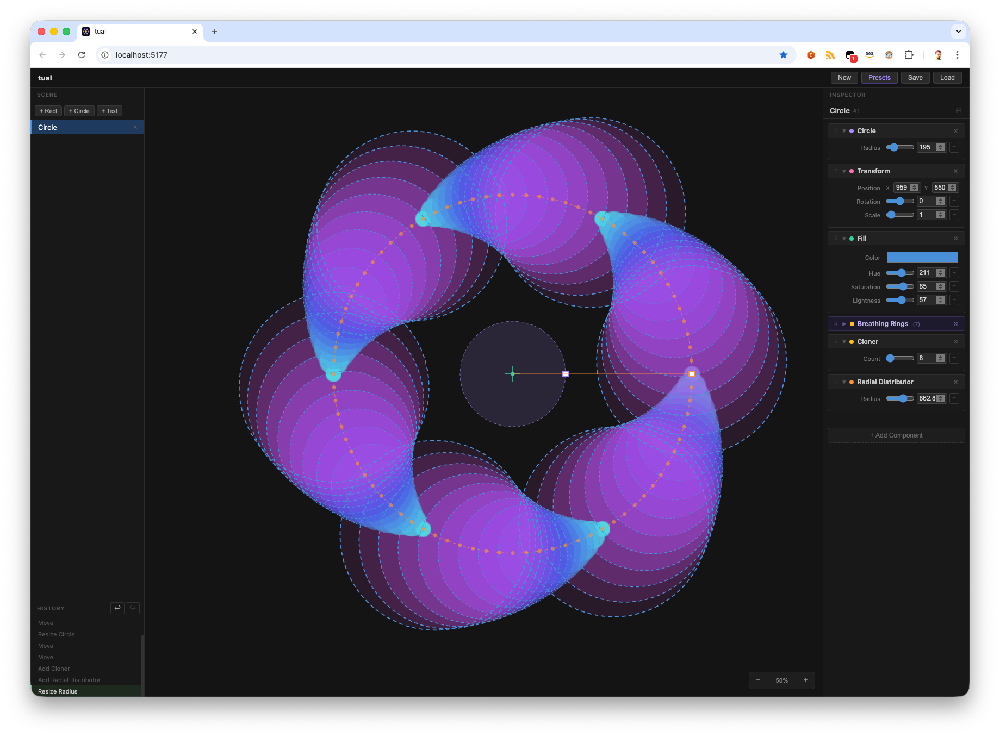

# tual

A procedural / parametric graphics editor built on an Entity-Component-System (ECS) architecture.



Each shape in the scene is an **entity**. Its visual properties — geometry, transformations, cloning patterns, styling — are defined by **components** that are stacked and processed in a deterministic pipeline. The result is a non-destructive, composable design tool where every visual is a description of _how_ to produce it, not just _what_ it looks like.

## Design philosophy

### ECS pipeline

Components are ordered into four pipeline stages that run sequentially per entity:

```
Shape → Modifier → Style → Effect
```

- **Shape** — generates the initial set of `DrawItem`s (rect, circle, text, …)
- **Modifier** — transforms or multiplies the item array (cloners, mirrors, …)
- **Style** — applies visual properties to every item (fill, stroke, opacity, shadow, …)
- **Effect** — post-processing passes (planned)

An entity with no Shape component produces no output regardless of what else is attached. Multiple Shape components produce multiple base items. Modifiers downstream multiply all items they receive. Style components apply to every item in the array — a single Fill component colors all clones.

This staging model means composition is predictable: you can reason about what each component does independently of the others.

### Components are data

Each component owns typed `Prop` instances (`NumberProp`, `ColorProp`, `Vec2Prop`, …). These are the only mutable state. The pipeline is a pure function over component props — running it twice with the same props returns the same result. This makes undo/redo, serialization, and testing straightforward.

### Gizmos and handles

Components can optionally render a canvas overlay (`renderGizmo`) and expose interactive drag handles (`getGizmoHandles`). Gizmos are drawn in screen space after the main scene render, so they remain constant size regardless of zoom. Handles are hit-tested on mousedown before entity selection, so a component can intercept interaction and edit its own props directly — for example, dragging a corner handle on a rect resizes width/height, dragging the radius handle on a radial cloner adjusts its radius.

### Scene vs. entities

The scene background and other global properties live in a `SceneStore` singleton, separate from the entity pipeline. This keeps the pipeline pure and avoids treating global properties as a special-cased entity.

## Components

### Shapes
| Component | Props |
|-----------|-------|
| Rectangle | width, height |
| Circle | radius |
| Text | content, font size |

### Modifiers
| Component | Props |
|-----------|-------|
| Radial Cloner | count, radius |
| Linear Cloner | count, spacing X/Y |
| Grid Cloner | count, columns, spacing X/Y |
| Mirror | axis (X/Y), keep original |

### Styles
| Component | Props |
|-----------|-------|
| Fill | color |
| Stroke | color, width |
| Opacity | opacity |
| Shadow | blur, offset X/Y, color |
| Transform | position (X/Y) |

## Stack

- **TypeScript** — strict, no `any`
- **React** — UI shell (inspector, scene tree, top bar) — not involved in rendering
- **Canvas 2D API** — all drawing, gizmos, and hit testing
- **Vite** + **Vitest** — build and unit/integration tests

## Development

```bash
npm install
npm run dev      # dev server
npm test         # run tests
npm run build    # production build
```
